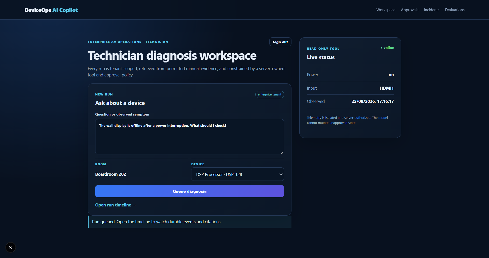
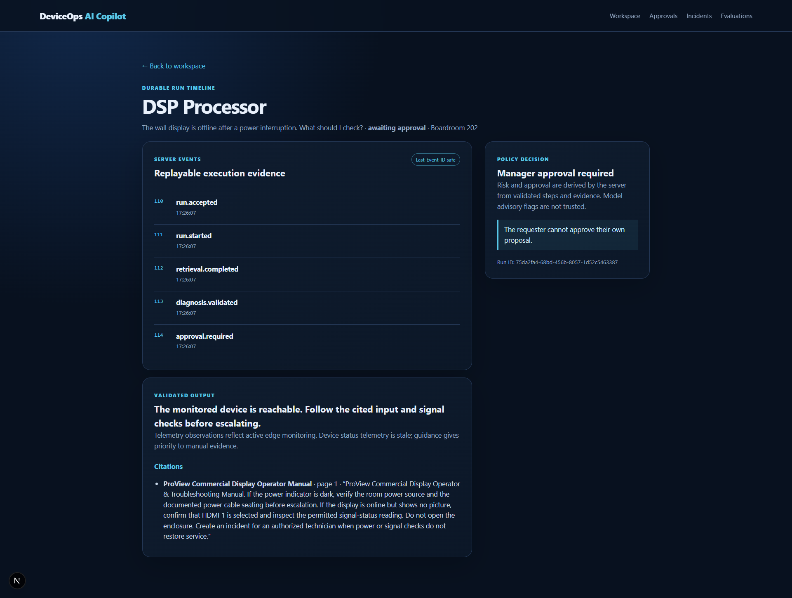
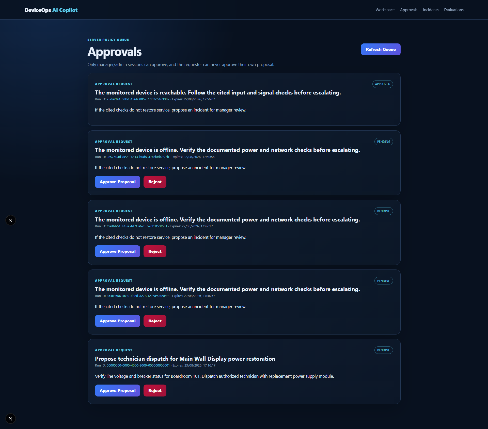
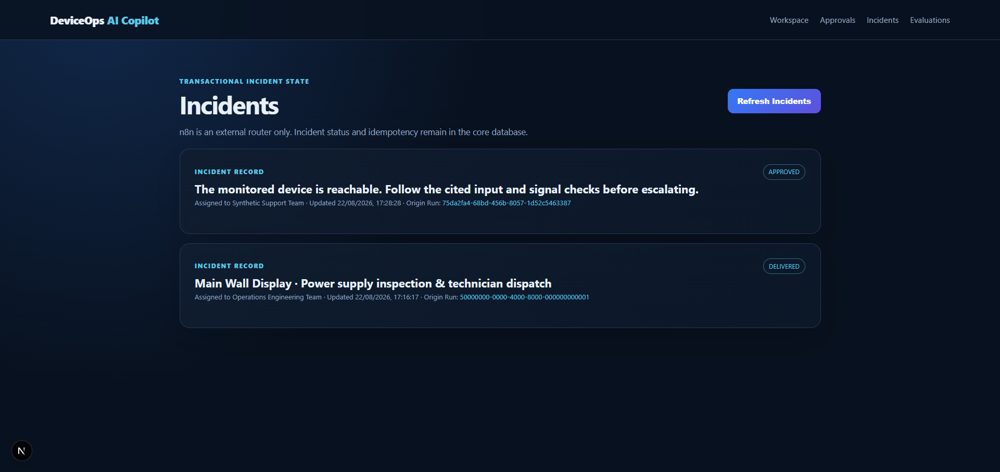
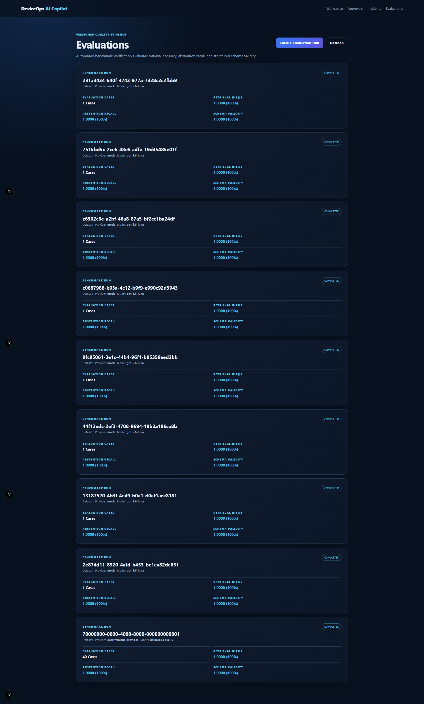
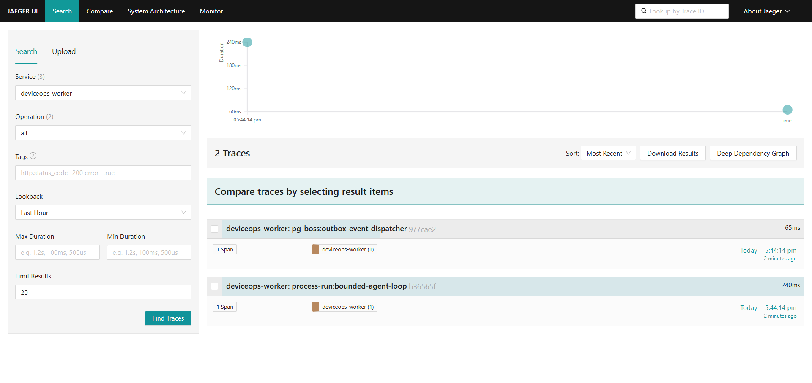

# DeviceOps AI Copilot

Production-ready reference implementation for synthetic device-operations data. It demonstrates a secure full-stack Applied AI workflow: permission-filtered manual retrieval, validated citations, read-only simulated telemetry, a bounded provider loop, server-derived approval, durable jobs/events, audit records, and signed n8n routing.

> Source available for portfolio review; all rights reserved; no permission to reuse or redistribute.

This is not a hosted SaaS claim. It uses fictional manuals and simulated telemetry. The default provider is deterministic mock data; the OpenAI adapter is included but requires a real key before publishing provider quality, latency, cost, or scale claims. There is no real device control.

## Visual Architecture & System Tour

### Core Web Workspace & Diagnostic Timeline
| Diagnosis Workspace | Real-Time SSE Run Timeline & Citations |
| :---: | :---: |
|  |  |

### Human-in-the-Loop Approvals & Incidents
| Manager Approvals Queue | Incident Escalation Dashboard |
| :---: | :---: |
|  |  |

### Quality Evidence & Distributed Tracing
| Automated 40-Case Evaluation Suite | Jaeger Distributed Traces (API & Worker) |
| :---: | :---: |
|  |  |

## Connected Repositories

- 🖥️ **Core Monorepo (`deviceops-ai-copilot`)**: Current repository (Next.js 16, pgvector RAG, workers, MCP, Zod contracts, Jaeger tracing).
- 📱 **Mobile Companion App**: [github.com/U7ama/deviceops-mobile](https://github.com/U7ama/deviceops-mobile) — Expo SDK 56 technician client with offline cache and durable SSE run polling.
- ⚡ **Automations Adapter**: [github.com/U7ama/deviceops-automations](https://github.com/U7ama/deviceops-automations) — Version-controlled n8n incident routing with HMAC-signed webhooks and dead-letter handling.

## Repository map

- `apps/web` — Next.js dashboard, cookie/mobile auth, CSRF, API v1, durable SSE replay, media quarantine endpoints, health/readiness/metrics.
- `apps/worker` — pg-boss worker for durable diagnosis jobs and outbox recovery.
- `apps/mcp` — explicitly tenant-bound, read-only MCP adapter; no model or MCP argument can choose a tenant.
- `packages/core` — run state machine, hybrid retrieval, diagnosis persistence, approval and incident transaction boundaries.
- `packages/contracts` — Zod request/output/event schemas and contract manifest.
- `packages/db` — PostgreSQL access, RLS transaction context, append-only audit hash chain, checked-in migration.
- `packages/ai` — deterministic mock and optional OpenAI-compatible provider with schema validation and usage ledger.
- `packages/media` — provider abstraction, local ext4 quarantine store, fixture scanner, ClamAV adapter, and S3 contract.
- [`deviceops-mobile`](https://github.com/U7ama/deviceops-mobile) — companion Expo technician client using mobile sessions and server-authoritative polling.
- [`deviceops-automations`](https://github.com/U7ama/deviceops-automations) — importable n8n signed incident notification/ack workflow.

## Local verification

Use Node 22.16 (`.nvmrc`) and keep data under WSL ext4. Docker Desktop must be running.

```bash
source "$HOME/.nvm/nvm.sh" && nvm use 22.16.0
cp .env.example .env
docker compose up -d postgres
npm install
npm run db:migrate
SEED_PASSWORD='temporary-local-password' npm run db:seed
npm run typecheck
npm test
npm run build --workspace @deviceops/web
```

Run the web app and worker with `DATABASE_URL` and `DATABASE_ADMIN_URL` pointing to `127.0.0.1`, `AI_PROVIDER=mock`, and `N8N_WEBHOOK_SECRET` set to a local-only value. Then run:

```bash
npm run test:api-smoke
npm run contracts:check
```

The API smoke test proves idempotent run creation, RLS tenant isolation, citation-bearing diagnosis, durable event replay, separation of duties, approval replay protection, one incident, one transactional outbox event, and fail-closed media quarantine. A separate local Compose drill verifies the signed n8n workflow, Mailpit delivery, acknowledgement, and duplicate-delivery suppression. These drills do not prove cloud deployment, real-provider quality, or production ClamAV availability.

## Verified local evidence

The current local reference run uses `AI_PROVIDER=mock` and synthetic data. The following evidence has been run from this repository:

- `npm run verify` — all workspace typechecks, 18 Vitest tests, and the Next.js/worker/MCP production build pass.
- `npm run eval` — 40 deterministic cases; retrieval hit@5 `1.0000`, abstention recall `1.0000`, and mock diagnosis schema validity `1.0000`.
- `npm run test:api-smoke` — idempotency, tenant isolation, separation of duties, durable SSE events, approval replay protection, signed webhook handling, outbox uniqueness, and infected-fixture rejection pass.
- `npm run test:mcp` — read-only tools and tenant-bound health resource pass.
- `npm run test:web:e2e` — a Playwright smoke flow is checked in under `tests/web`; install the pinned browser with `npx playwright install chromium` before running it on a workstation with browser-download access.
- `npm run load:http` — local-only `/healthz` check recorded 537 requests in 5 seconds with 0 errors, p50 80 ms and p99 199 ms in the current WSL run. This is not a production-capacity claim.
- The companion Expo app has been installed as an EAS Android development build and exercised on a physical synthetic-data device: login, device status, diagnosis queue, durable timeline, citation display, and approval-required state were observed. The build is still a development artifact, not a store release.

The real-provider, S3, managed scanner, cloud deployment, Playwright/Maestro command execution, and public hosted demo remain unverified until their credentials/tooling are available. Do not describe those as delivered evidence.

The local HTTP and MCP checks are explicit about their evidence boundary:

```bash
npm run load:http   # real local HTTP concurrency against /healthz
npm run test:mcp    # stdio MCP handshake, tool allow-list, and tenant-bound health resource
```

The HTTP benchmark is a local process/database-environment check, not a production-scale or cloud-capacity claim. The MCP smoke test verifies the adapter contract and read-only surface; authorized tool data calls still require a configured database context.

## Backup and restore drill

The repository includes host-client-free scripts that run PostgreSQL tools inside the pinned Compose image:

```bash
chmod +x scripts/backup.sh scripts/restore.sh
backup=$(scripts/backup.sh | awk '{print $3}')
scripts/restore.sh "$backup" deviceops_restore
docker compose exec -T postgres psql -U postgres -d deviceops_restore -c 'select count(*) from tenants;'
```

Restore only into a disposable database. Production operations should send encrypted backups to separate storage, test a restore on a schedule, and record RPO/RTO results; the local drill is evidence that the schema and data can be restored, not a production backup guarantee.

## Operational boundary

Local media uses a WSL-ext4 filesystem and fixture-only scanning. Arbitrary uploads remain quarantined unless their hash is explicitly allowlisted. Production must use private S3 quarantine/clean prefixes and a real ClamAV service (or a reviewed managed scanner); scanner errors fail closed. The local `compose.yaml` is a development stack, not an RPO/RTO or availability guarantee.

Read the request trace in `ARCHITECTURE_WALKTHROUGH.md`, security controls in `SECURITY.md` and `THREAT_MODEL.md`, recovery exercises in `FAILURE_LAB.md`, and decisions in `docs/adr/` before treating this as portfolio evidence.
